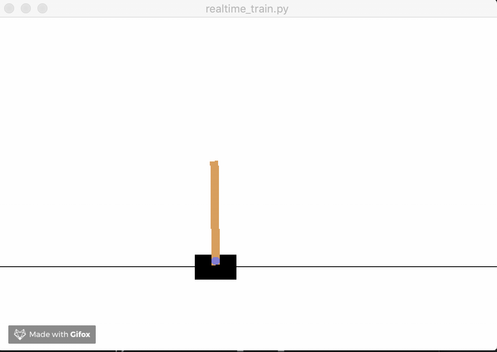

# DNN_gym_openai

* Experimented with OpenAI gym, A toolkit for developing and comparing reinforcement learning algorithms.
* Created my own training dataset using random instances of the game which passed a minimum score requirement. 
* Used Feed Forward (Fully Connected) Neural Networks to make the bot learn and play by itself.

## Instructions for use

* Install requirements. `$ pip install -r requirements.txt`
* Run file. `$ python3 realtime_train.py`

## In Use

